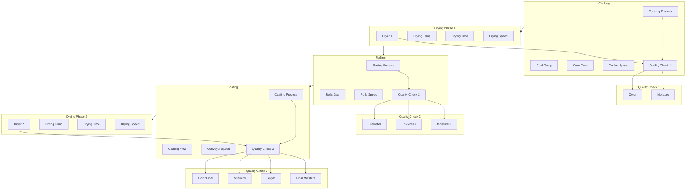
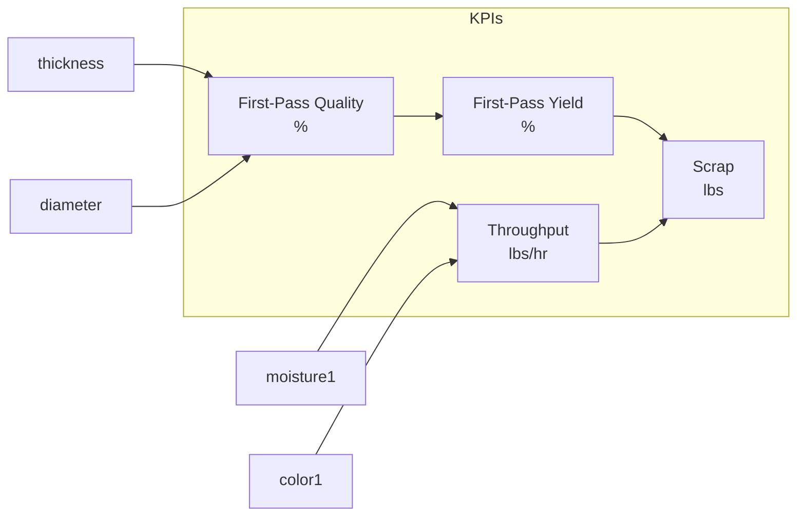

# Cereal Manufacturing Process Documentation

## Process Overview

## Process Parameters and Specifications

### 1. Cooking Process
- **Cook Temperature**
  - Range: 450°F ± 10°F
  - Relations: High correlation with Color
- **Cook Time**
  - Range: 20-30 minutes
- **Cooker Speed**
  - Range: 50 rpm ± 5 rpm

### 2. Dryer 1
- **Drying Temperature**
  - Range: 250°F ± 10°F
  - Relations: High correlation with Moisture
- **Drying Time**
  - Range: 10 minutes ± 1 minute
- **Drying Speed**
  - Range: 400 ft/min ± 20 ft/min

### 3. Quality Checks 1
- **Moisture**
  - Range: 0-100%
  - Target: 20% ± 2%
  - Critical: High relation to flaking quality
- **Color**
  - Range: 1-10
  - Target: 6-8
  - Note: Marketing requirement, no downstream impact

### 4. Flaking Process
- **Flaking Rolls Gap**
  - Range: 2mm ± 0.1mm
  - Critical: High relation to Thickness and Diameter
- **Flaking Rolls Speed**
  - Range: 300 rpm ± 10 rpm

### 5. Quality Checks 2
- **Moisture 2**
  - Range: 0-100%
  - Target: 20% ± 2%
- **Thickness**
  - Range: 0-1mm
  - Target: 0.5-0.9mm
  - Critical: Direct impact on First-Pass Quality
- **Diameter**
  - Range: 2-10mm
  - Target: 4-8mm
  - Critical: Direct impact on First-Pass Quality

### 6. Coating Process
- **Coating Flow**
  - Range: 2 gal/min ± 0.1 gal/min
  - Relations: High correlation with Sugar and Vitamins content
- **Conveyor Speed**
  - Range: 400 ft/min ± 10 ft/min

### 7. Dryer 2
- **Drying Temperature**
  - Range: 250°F ± 10°F
  - Relations: High correlation with Final Moisture
- **Drying Time**
  - Range: 10 minutes ± 1 minute
- **Drying Speed**
  - Range: 400 ft/min ± 20 ft/min

### 8. Quality Checks 3
- **Final Moisture**
  - Range: 0-100%
  - Target: 20% ± 2%
  - Critical: Out of spec requires scrapping
- **Sugar**
  - Range: 0-100%
  - Target: 40% ± 5%
  - Critical: Out of spec requires scrapping
- **Vitamins**
  - Range: 0-100%
  - Target: 10% ± 2%
  - Critical: Out of spec requires scrapping
- **Color Final**
  - Range: 1-10
  - Target: 6-8
  - Note: Marketing requirement

## Key Performance Indicators (KPIs)

### Critical Relationships
1. **First-Pass Quality**
   - Primarily determined by Thickness and Diameter specifications
   - Must meet all quality parameters to achieve 100%

2. **First-Pass Yield**
   - Directly influenced by First-Pass Quality
   - Represents actual production efficiency

3. **Scrap**
   - Generated from:
     - Out-of-spec thickness/diameter
     - Moisture content deviation
     - Sugar/Vitamin content deviation
   - Inversely related to First-Pass Yield

4. **Throughput**
   - Influenced by:
     - Cooker Speed
     - Drying Speeds
     - Moisture Content