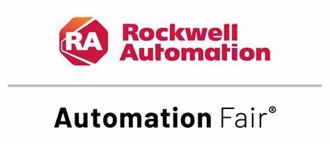

# 🏭 Rockwell Automation Fair Demos


A collection of industrial AI/ML demonstrations showcasing practical applications of artificial intelligence in manufacturing processes. These demos were presented at Rockwell Automation Fair events and serve as educational resources for implementing AI in industrial settings.

## 🎯 Overview

This repository demonstrates real-world applications of AI/ML in manufacturing, focusing on:
- Process optimization through machine learning
- Data-driven decision making
- Practical implementation approaches
- Integration with industrial systems

Each demo is designed to illustrate both the technical implementation and business value of AI in manufacturing.

## 📂 Repository Structure

```
.
├── 2024/
│   ├── README.md                  # 2024 demos documentation
│   └── cereal_demo_final.ipynb    # Cereal process optimization notebook
├── requirements.txt               # Project dependencies
├── LICENSE                        # MIT License
└── README.md                      # This file
```

## 🗂️ Available Demonstrations

### 2024: Cereal Manufacturing Process Optimization
[View Demo](/2024/README.md)

A comprehensive demonstration of:
- Manufacturing process optimization using ML
- Multi-objective optimization (quality, throughput, scrap)
- XGBoost regression models
- Hyperparameter tuning with Optuna
- Real-time parameter optimization

**Technologies Used:**
- Python 3.8+
- XGBoost
- Optuna
- Scikit-learn
- OpenAI API

## 🚀 Getting Started

### System Requirements
- Python 3.8 or higher
- 8GB RAM minimum
- OpenAI API key
- Git

### Quick Start
```bash
# Clone repository
git clone https://github.com/everett-clemons/AF_Demos.git
cd AF_Demos

# Create virtual environment
python -m venv venv
source venv/bin/activate  # Linux/macOS
# or
venv\Scripts\activate     # Windows

# Install dependencies
pip install -r requirements.txt

# Set up OpenAI API key
echo "OPENAI_API_KEY=your_key_here" > .env
```

For detailed setup instructions, see [Installation Guide](INSTALL.md).

## 📖 Documentation

Each demonstration includes:
- Detailed README
- Jupyter notebooks with step-by-step explanations
- Implementation guidelines
- Performance metrics
- Visualization examples

## ⚠️ Important Notes

- These demos are educational resources, not production-ready solutions
- Each implementation requires customization for specific use cases
- Consider data quality and safety requirements for your application
- Regular model retraining may be necessary
- Ensure compliance with your organization's AI/ML guidelines

## 📝 License

This project is licensed under the MIT License - see the [LICENSE](LICENSE) file for details.

## 📞 Contact

**Everett Clemons**  
Rockwell Automation  
everett.clemons@rockwellautomation.com

## 🙏 Acknowledgments
- **John Clemons** - Rockwell Automation
- **Tim Gellner** - Rockwell Automation
- The Rockwell Automation Fair team

## 📅 Version History

| Year | Demo | Event | Key Features |
|------|------|-------|--------------|
| 2024 | Cereal Process Optimization | Automation Fair 2024, Anaheim | • ML-driven process optimization<br>• Multi-objective optimization<br>• Real-time parameter tuning |

## 🔜 Coming Soon
- Additional industry-specific examples
- Integration with FT Optix and FactoryTalk Production Center

---
*Last Updated: November 2024*